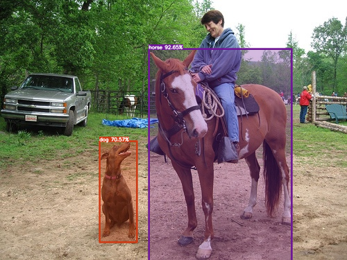

# ONNX-YOLO-World-Open-Vocabulary-Object-Detection for AX

## The original repo

[ONNX-YOLO-World-Open-Vocabulary-Object-Detection](https://github.com/ibaiGorordo/ONNX-YOLO-World-Open-Vocabulary-Object-Detection)

## 背景
开集目标检测检测成为今年端侧目标检测的新方向，其中 YOLO World 深受开发者群体推荐。本项目用于指导开发者完成以下内容：

- 导出 class num = 4 的 YOLO World ONNX 模型；
- 导出 YOLO World ONNX 输入匹配的 class num = 4 的 text 特征，并完成 python 运行，检测出 text 指定的 class 目标；
- 导出 class num = 4 的 YOLO World ONNX 模型, 并完成后处理变化，方便在 AXERA 的 NPU 芯片平台上部署；
- 生成 AXERA NPU 模型转换工具 Pulsar2 编译依赖的 text 量化校准数据集。

## 模型导出

### 图片检测模型

#### 部署模型

适合用于 AXera NPU 工具链 Pulsar2 模型转换的 ONNX 模型

- 下载 `yolov8s-worldv2.pt`
- 使用 `yoloworld/ModelExporter_ax.py` 更新 `yoloworld/ModelExporter.py`
- 导出 YOLO World 目标检测模型并保存到 `models/yolov8s-worldv2-ax.onnx`

```
./export_ax.sh
```

#### 原始模型

适合用于本项目直接调用 python onnxruntime 进行推理运行的 ONNX 模型

- 下载 `yolov8s-worldv2.pt`
- 使用 `yoloworld/ModelExporter_original.py` 更新 `yoloworld/ModelExporter.py`
- 导出 YOLO World 目标检测模型并保存到 `models/yolov8s-worldv2-original.onnx`

```
./export_original.sh
```

### 文本编码模型

- 导出 YOLO World 对应文本编码模型并保存到 `models/yoloworld.vitb.txt.onnx`
- 生成 Pulsar2 编译 `yoloworld.vitb.txt.onnx` 依赖的量化校准数据 `yolo_world_calib_token_data.tar`

```
python export_clip_text_model.py
```

- 导出 YOLO World 检测模型输入的文本特征数据
- 导出 YOLO World 目标检测模型在使用 Pulsar2 编译时依赖的 text 量化校准数据集 `yolo_world_calib_txt_data.tar`

```
python save_coco_npy.py
tar -cvf yolo_world_calib_txt_data.tar tmp/*.npy
```

## 测试

### 本地测试

可以使用 `python save_class_embeddings.py` 来生成自定义的 4 分类的文本编码数据或者使用 `./tmp` 中已经存在的 4 分类文本编码数据

- 图片检测模型：yolov8s-worldv2-original.onnx
- 输入图片：ssd_horse.jpg
- 输入文本：dog.npz, 对应的 4 分类 `'dog' 'horse' 'sheep' 'cow'`

```
python image_object_detection.py
```



### 上板测试

- AX650N 
- 执行程序：ax_yolo_world_open_vocabulary
- 图片检测模型：yoloworldv2_4cls_50_npu3.axmodel
- 输入图片：ssd_horse.jpg
- 输入文本：dog.bin, 对应的 4 分类 `'dog' 'horse' 'sheep' 'cow'`

```
root@ax650:xxx# ./ax_yolo_world_open_vocabulary -m yoloworldv2_4cls_50_npu3.axmodel -i ssd_horse.jpg -t dog.bin
--------------------------------------
model file : yoloworldv2_4cls_50_npu3.axmodel
image file : ssd_horse.jpg
img_h, img_w : 640 640
--------------------------------------
Engine creating handle is done.
Engine creating context is done.
Engine get io info is done.

input size: 2
    name:   images [UINT8] [RGB]
        1 x 640 x 640 x 3

    name: txt_feats [FLOAT32] [FEATUREMAP]
        1 x 4 x 512


output size: 3
    name:  stride8 [FLOAT32]
        1 x 80 x 80 x 68

    name: stride16 [FLOAT32]
        1 x 40 x 40 x 68

    name: stride32 [FLOAT32]
        1 x 20 x 20 x 68

Engine alloc io is done.
Engine push input is done.
--------------------------------------
post process cost time:0.86 ms
--------------------------------------
Repeat 1 times, avg time 4.36 ms, max_time 4.36 ms, min_time 4.36 ms
--------------------------------------
detection num: 2
 1:  91%, [ 215,   71,  421,  374], class2
 0:  67%, [ 144,  204,  197,  346], class1
--------------------------------------

```


### 模型编译

- Pulsar2 安装及使用请参考相关文档
  - [在线文档](https://pulsar2-docs.readthedocs.io/zh-cn/latest/index.html)
  - 随 AX650/AX620E SDK Release 包发布
- 相关文件请在 Release 中获取

```
pulsar2 build --input yolov8s-worldv2-ax.onnx --config yoloworld.json --output_dir output --output_name yoloworldv2_4cls_50_npu3.axmodel --npu_mode NPU3
```

```
xxx@yyy:~/yolo_world_v2$ tree -L 1 output/
output_50/
├── build_context.json
├── compiler
├── frontend
├── quant
└── yoloworldv2_4cls_50_npu3.axmodel
```
