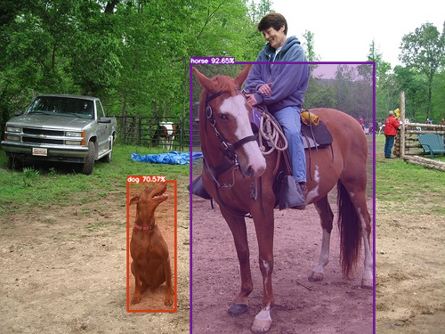
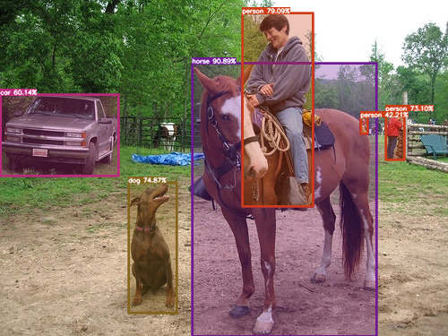

# ONNX-YOLO-World-Open-Vocabulary-Object-Detection for AX

## The original repo

[ONNX-YOLO-World-Open-Vocabulary-Object-Detection](https://github.com/ibaiGorordo/ONNX-YOLO-World-Open-Vocabulary-Object-Detection)

## 背景
开集目标检测检测成为今年端侧目标检测的新方向，其中 YOLO World 深受开发者群体推荐。本项目用于指导开发者完成以下内容：

- 导出 class num = 4 的 YOLO World ONNX 模型；
- 导出 YOLO World ONNX 输入匹配的 class num = 4 的 text 特征，并完成 python 运行，检测出 text 指定的 class 目标；
- 导出 class num = 4 的 YOLO World ONNX 模型, 并完成后处理变化，方便在 AXERA 的 NPU 芯片平台上部署；
- 生成 AXERA NPU 模型转换工具 Pulsar2 编译依赖的 text 量化校准数据集。

## 模型导出

### 图片检测模型


部署模型和原始模型相比，减少了后处理部分。两个版本都支持板上测试。在16bit量化下，减少后处理后，精度有细微提升，更低bit量化提升更明显。
#### 部署模型

适合用于 AXera NPU 工具链 Pulsar2 模型转换的 ONNX 模型

- 下载 `yolov8s-worldv2.pt`
- 使用 `yoloworld/ModelExporter_ax.py` 更新 `yoloworld/ModelExporter.py`
- 导出 YOLO World 目标检测模型并保存到 `models/yolov8s-worldv2-ax.onnx`

```
./export_ax.sh
```

#### 原始模型

适合用于本项目直接调用 python onnxruntime 进行推理运行的 ONNX 模型

- 下载 `yolov8s-worldv2.pt`
- 使用 `yoloworld/ModelExporter_original.py` 更新 `yoloworld/ModelExporter.py`
- 导出 YOLO World 目标检测模型并保存到 `models/yolov8s-worldv2-l-original.onnx`

```
./export_original.sh
```

### 文本编码模型

- 导出 YOLO World 对应文本编码模型并保存到 `models/yoloworld.vitb.txt.onnx`
- 生成 Pulsar2 编译 `yoloworld.vitb.txt.onnx` 依赖的量化校准数据 `yolo_world_calib_token_data.tar`

```
python export_clip_text_model.py
```

- 导出 YOLO World 检测模型输入的文本特征数据
- 导出 YOLO World 目标检测模型在使用 Pulsar2 编译时依赖的 text 量化校准数据集 `yolo_world_calib_txt_data.tar`

```
python save_coco_npy.py
tar -cvf yolo_world_calib_txt_data.tar tmp/*.npy
```

## 测试

### 本地测试

可以使用 `python save_class_embeddings.py` 来生成自定义的 4 分类的文本编码数据或者使用 `./tmp` 中已经存在的 4 分类文本编码数据

- 图片检测模型：yolov8s-worldv2-ax.onnx
- 输入图片：ssd_horse.jpg
- 输入文本：dog.npz, 对应的 4 分类 `'dog' 'horse' 'sheep' 'cow'`

```
python image_object_detection.py
or
python image_object_detection_with_clip.py
```




### 含clip模型板上部署的demo
此demo基于编译完成的clip和yolo模型的axmodel，在板上实现目标检测功能
#### 模型编译

- Pulsar2 安装及使用请参考相关文档
  - [在线文档](https://pulsar2-docs.readthedocs.io/zh-cn/latest/index.html)
  - 随 AX650/AX620E SDK Release 包发布
- 相关文件请在 Release 中获取

此处均使用16bit模型
- 编译命令
```
# yoloword
pulsar2 build --config yoloworld.json --input models/yolov8s-worldv2-ax.onnx --output_dir yolo_u16/ --output_name yolo_u16_ax.axmodel --npu_mode NPU3

# clip
pulsar2 build --config yoloworld_clip.json --input yoloworld.vitb.txt.b1.onnx --output_dir clip_u16/ --output_name clip_b1_u16.axmodel --npu_mode NPU3
```

#### 数据准备
clip模型的输入demo_text_token_onboard.npy,在运行image_object_detection_with_clip.py时保存


#### 上板运行

需基于[PyAXEngine](https://github.com/AXERA-TECH/pyaxengine)在AX650N上进行部署
- AX650N 
- 执行程序：yoloworld_onboard/image_object_detection_onboard.py
- 生成text input tensor的clip模型: clip_b1_u16.axmodel
- 图片检测模型：yolo_u16_ax.axmodel
- 输入token: demo_text_token_onboard.npy
- 输入图片：ssd_horse.jpg
- 4 分类: ["person", "dog", "car", "horse"]

将./yoloworld_onboard复制到开发板上, 并准备好两个编译好的axmodel, 运行下述命令，即可得到结果output_ssd_horse_result.png
```
cd yoloworld_onboard
python3 image_object_detection_onboard.py
```




注：

    yolo对bbox的后处理可能影响模型精度，因此用./export_ax.sh得到不含后处理的模型，后处理过程在yoloworld/YOLOWorld.py的get_predictions函数中给出。后处理过程从原ultralytics中剥离，仅供参考。
    
    如使用export_original.sh导出的onnx模型，请将yoloworld/YOLOWorld.py中的use_ax_model改为False，板上运行代码同理。